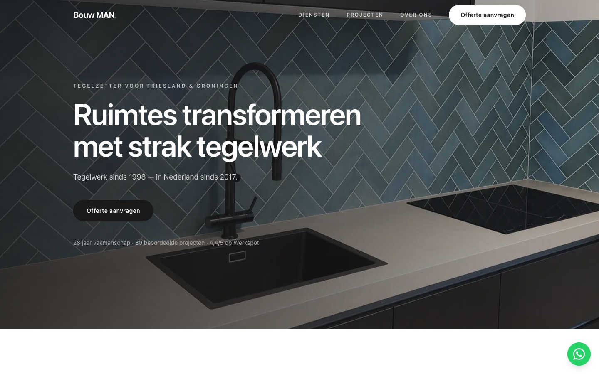
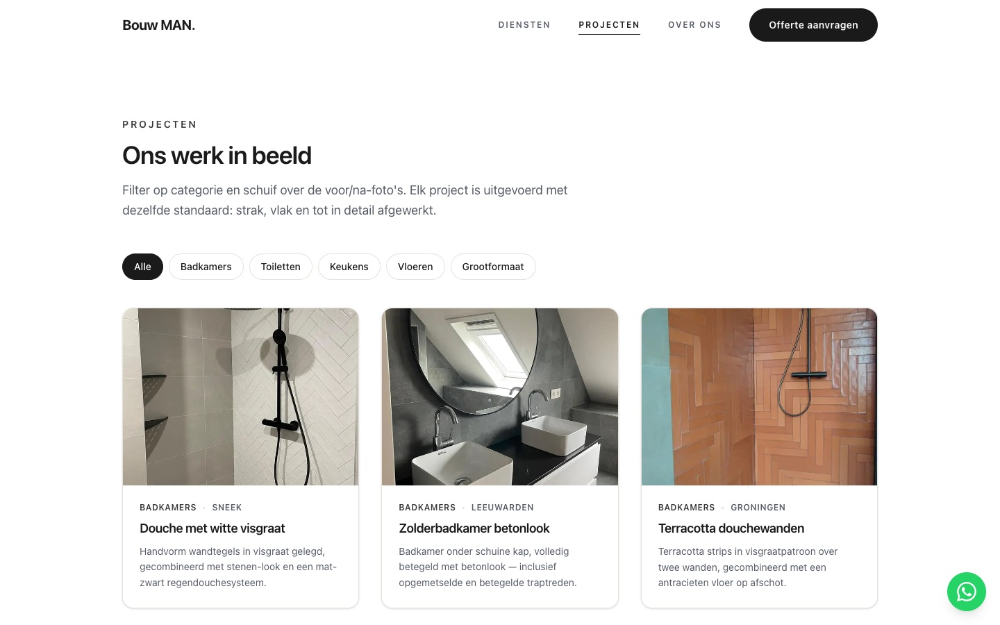
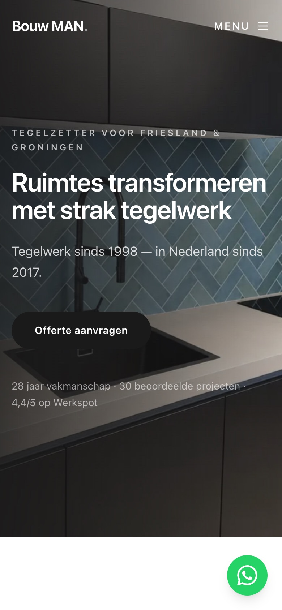

# Bouw MAN — bedrijfswebsite voor een tegelzetbedrijf

**Live: [bouwmantegelwerk.nl](https://bouwmantegelwerk.nl)**

Een complete bedrijfswebsite voor Bouw MAN, een tegelzetbedrijf in Friesland en
Groningen. Ik heb het project van begin tot eind zelf gedaan: ontwerp,
frontend, formulierverwerking, privacy/cookies, SEO en de hosting op een eigen
Linux-server. De site staat live en is in gebruik.



<p>
  
  
</p>

## Techniek

- **Next.js 16** (App Router, Server Components) met **TypeScript**
- **Tailwind CSS v4** met eigen design tokens in `app/globals.css`
- **Framer Motion** voor scroll- en fade-animaties
- **Nodemailer** voor het versturen van het offerteformulier via SMTP
- **Mapbox GL** voor de kaart van het werkgebied
- Hosting: **Ubuntu-VPS** met **nginx** (reverse proxy), **pm2** en **Cloudflare** (DNS, SSL, CDN)

## Wat er in zit

- **Zes pagina's:** Home, Diensten, Projecten, Reviews, Over ons en Contact, plus een privacy- en een toegankelijkheidspagina.
- **Offerteformulier met eigen API-route** (`app/api/offerte/route.ts`): validatie aan de server-kant, een honeypot tegen spam, HTML-escaping van invoer en een HTML-mail die ook in Outlook goed wordt weergegeven. Mail gaat bewust via de eigen mailserver van het domein in plaats van via een externe dienst, zodat SPF/DMARC kloppen en aanvragen niet in de spam belanden.
- **Cookiemelding met Google Consent Mode v2** (`lib/cookieConsent.ts`, `lib/googleConsent.ts`): analytics- en marketingscripts laden pas na toestemming, per categorie.
- **Projectenpagina** met filteren op categorie en een sleepbare **voor/na-vergelijking** (`components/BeforeAfter.tsx`).
- **Content op één plek:** alle teksten, diensten, projecten en reviews staan in `lib/data.ts`. Content aanpassen kan dus zonder componenten aan te raken.
- **SEO:** metadata per pagina, Open Graph-afbeelding, `sitemap.ts` en `robots.ts`.
- **Responsive en toegankelijk:** mobile-first opgebouwd, met semantische HTML, alt-teksten en toetsenbordbediening.

## Structuur

```
app/              pagina's (App Router) en de API-route voor het formulier
components/       herbruikbare componenten (header, kaarten, formulier, slider, cookiemelding)
lib/data.ts       alle content op één plek
lib/*Consent.ts   cookie-toestemming en koppeling met Google Consent Mode
public/images/    foto's van projecten en diensten
```

## Lokaal draaien

```bash
npm install
cp .env.example .env.local   # optioneel: Mapbox-token en SMTP-gegevens
npm run dev
```

De site draait dan op http://localhost:3000. Zonder `.env.local` werkt alles,
behalve de kaart en het daadwerkelijk versturen van het formulier.

## Deployment

De productiesite draait op een eigen VPS: nginx stuurt verkeer door naar het
Next.js-proces, dat door pm2 wordt beheerd en automatisch opstart na een
reboot. Cloudflare regelt DNS en HTTPS. Een update deployen gaat met
`git pull && npm install && npm run build && pm2 restart`.

---

Gemaakt door **Omar Abu Nabbout**, student Software Development.
Foto's en teksten zijn eigendom van Bouw MAN en gebruikt met toestemming.
